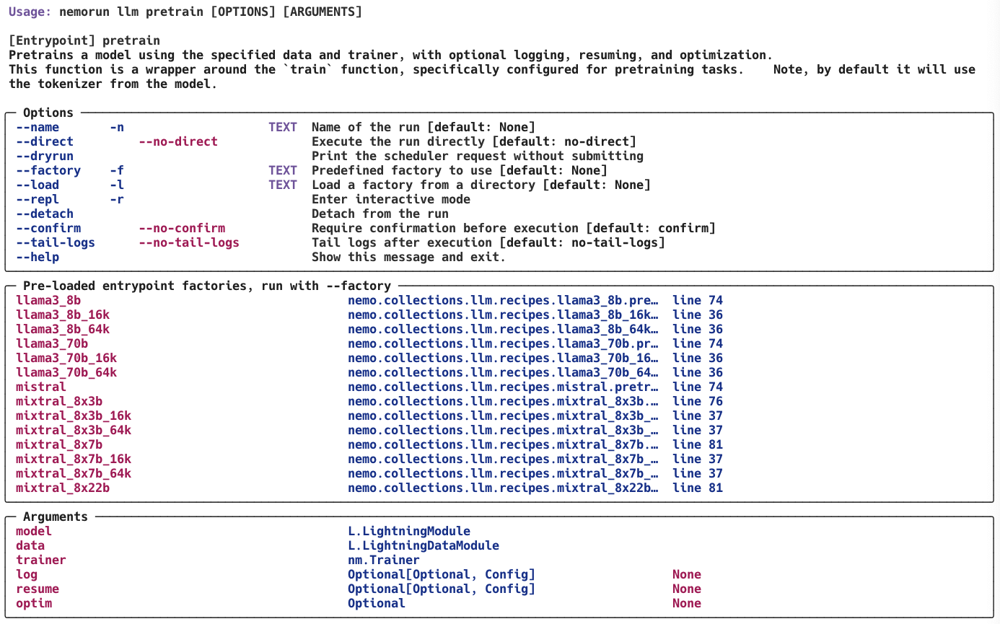
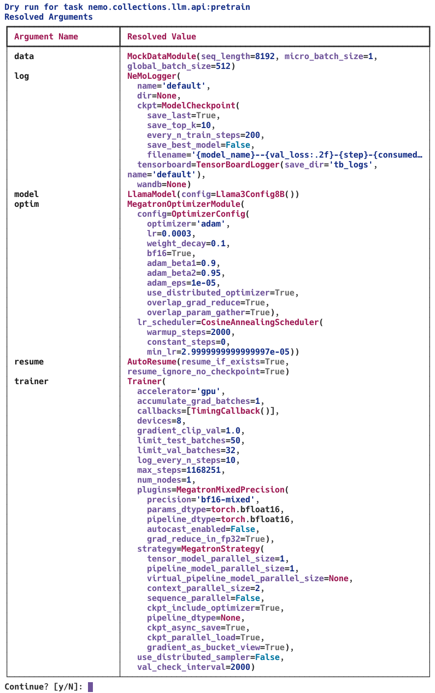
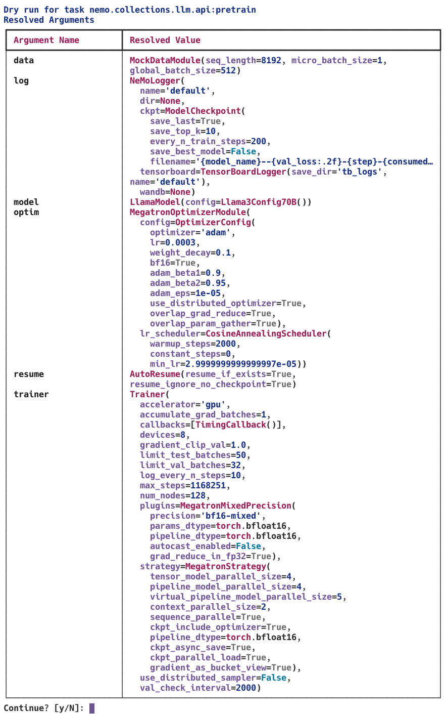
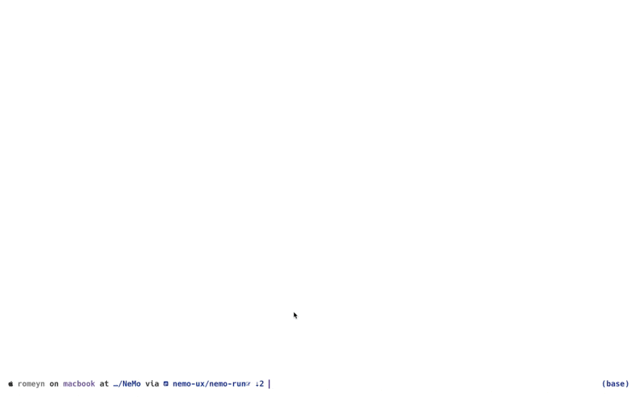

# Pre-training

### Listing the available recipes for pretraining

```bash
nemorun llm pretrain --help
```




### Run pre-training with a default recipe

```bash
nemorun llm pretrain --factory llama3_8b
```



We can also call the factory function with custom parameters:

```bash
nemorun llm pretrain --factory "llama3_70b(num_nodes=128)"
```




The CLI allows you to overwrite any parameter. For example, to run the recipe with 2000 steps: 

```bash
nemorun llm pretrain --factory llama3_70b trainer.max_steps=2000
```

The syntax of the CLI is the same as the Python code. Which is great but in some cases you might want to inspect the recipe interactively. An easy way to do this using the cli is the use the `--repl` flag.

```bash
nemorun llm pretrain --factory llama3_70b --repl
```




### Create and run a custom recipe

We can create a script that contains a custom recipe. See [custom_recipe.py](custom_recipe.py) for an example.

Note that we end the script with a call to `run.cli.main()`, which uses the same syntax as the CLI but allows us to provide specific defaults. We still can overwrite any parameter using the syntax `param=value`. We can set nested parameters using dotted notation, e.g. `trainer.max_steps=2000`.

When running the custom_recipe.py file, it will execute the `custom_llama3_8b` recipe by default. However, you can select different recipes or modify parameters using the following methods:

1. To select the `custom_llama3_70b` recipe:
   ```bash
   python custom_recipe.py --factory custom_llama3_70b
   ```
   This will automatically call the `custom_llama3_70b` function defined in the script.

2. To overwrite any parameter:
   ```bash
   python custom_recipe.py trainer.max_steps=2000
   ```

3. You can even apply transformations when triggering the CLI as if it's Python code:
   ```bash
   python custom_recipe.py "trainer.max_steps=*2"
   ```

These options provide flexibility in customizing your pretraining recipe directly from the command line.